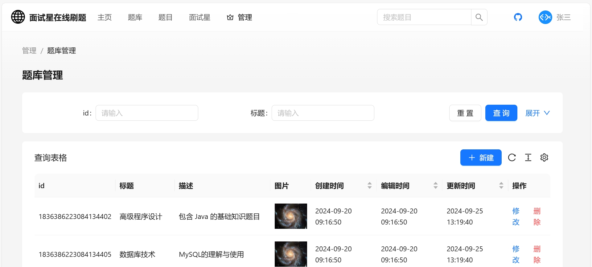
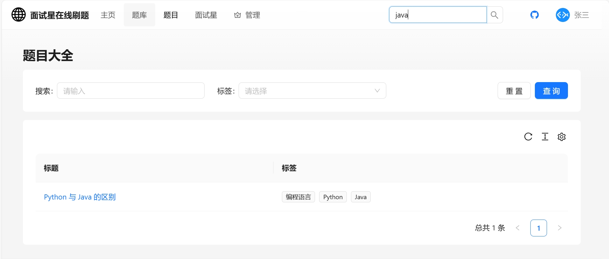
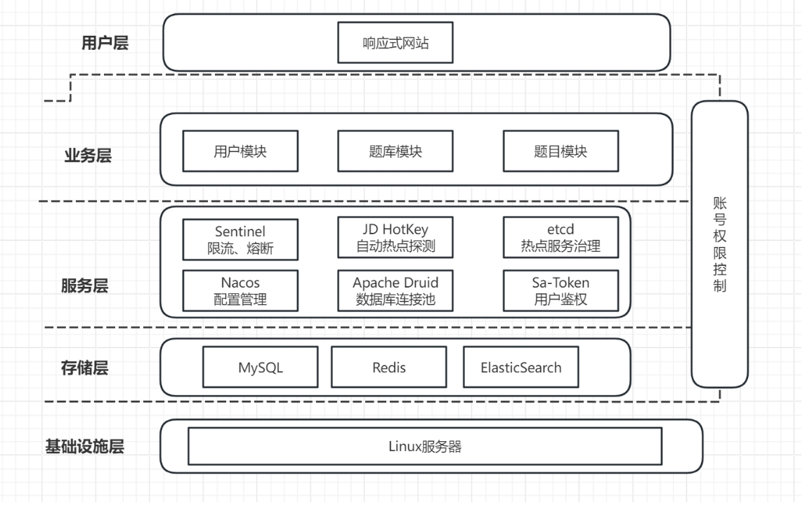
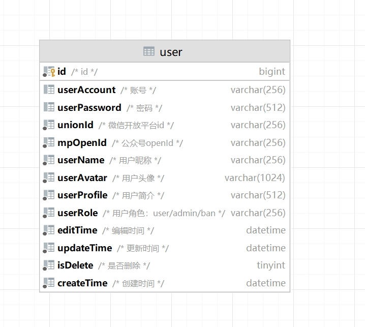

# 面试星在线刷题

## 项目背景

在当前的就业市场中，面试已成为求职过程中至关重要的一环。为了帮助求职者提高面试技能和通过率，面试星在线刷题应运而生。此网站旨在提供一个高效、便捷的学习和练习平台，帮助求职者系统地准备技术面试、行为面试等，提升综合素质

## 项目描述

此项目是一款在线刷题平台，分为题目、题库、用户三个模块，管理员和用户两种角色。

管理员可以创建题库、题目和题解；用户可以注册登录、分词检索题目、在线刷题并查看刷题记录日历图。

## 项目截图








## 项目架构介绍

### 简介

本项目基于Spring Boot+MySQL\+ MyBatis-Plus 框架 + MyBatis X+Redis+Elasticsearch +Next.js来实现，运用 Druid + HotKey + Sa-Token + Sentinel 提高了系统的性能和安全性。

### 架构图



### 项目结构

#### 项目结构图


#### 项目结构说明

```
|--annotation   权限校验注解
|--aop          权限校验aop
|--blackfilter  全局IP黑名单过滤
|--common       公共资源
|--config       配置类
|--constant     通用常量
|--controller   控制层
|--esdao        es操作
|--exception    异常类
|--job          es工具包
|--manager      管理包
|--mapper       mapper映射文件
|--model        数据包
|--satoken      用户鉴权
|--sentinel     限流熔断
|--service      业务逻辑层
```


## 业务功能

- 用户注册
- 用户登录（账号密码）
- 【管理员】管理用户 - 增删改查
- 查看题库列表
- 查看题库详情（展示题库下的题目）
- 【管理员】管理题库 - 增删改查
- 题目搜索、查看题目详情（进入刷题页面）
- 【管理员】管理题目 - 增删改查（比如按照题库查询题目、修改题目所属题库等）
- 分词题目搜索
- 用户刷题记录日历图
- 自动缓存热门题目
- 网站流量控制和熔断
- 动态 IP 黑白名单过滤
- 同端登录冲突检测
- 分级题目反爬虫策略

## 数据库设计

### 题目表


### 题库表


### 题目题库关联表


### 用户表

